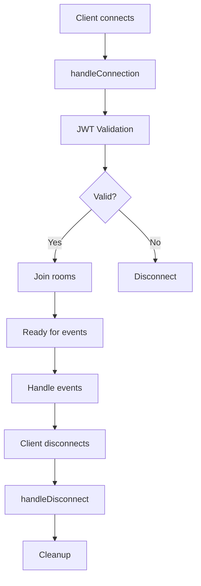

# 📖 Backend Theory - День 4: WebSocket и Real-time

> Глубокое понимание WebSocket коммуникаций и real-time архитектуры

---

## 📚 Содержание

1. [WebSocket vs HTTP](#1-websocket-vs-http)
2. [Socket.io Architecture](#2-socketio-architecture)
3. [NestJS WebSocket Gateway](#3-nestjs-websocket-gateway)
4. [Rooms и Namespaces](#4-rooms-и-namespaces)
5. [JWT в WebSocket](#5-jwt-в-websocket)
6. [События и Обработчики](#6-события-и-обработчики)
7. [Персональные Комнаты](#7-персональные-комнаты)

---

## 1. WebSocket vs HTTP

### HTTP - Request/Response модель

```
Client                     Server
  |    GET /messages         |
  |------------------------->|
  |                          |
  |    200 OK [messages]     |
  |<-------------------------|
  |                          |
  |    (connection closed)   |
```

**Характеристики HTTP:**
- **Односторонний**: Клиент инициирует, сервер отвечает
- **Stateless**: Каждый запрос независим
- **Overhead**: Новое TCP соединение для каждого запроса
- **Polling**: Для real-time нужен постоянный опрос

### WebSocket - Двусторонний канал

```
Client                     Server
  |    HTTP Upgrade          |
  |------------------------->|
  |    101 Switching         |
  |<-------------------------|
  |                          |
  |<---[WebSocket Open]----->|
  |                          |
  |    emit('message')       |
  |------------------------->|
  |    on('update')          |
  |<-------------------------|
  |    emit('typing')        |
  |------------------------->|
  |                          |
  |<---[Persistent]--------->|
```

**Характеристики WebSocket:**
- **Двусторонний**: Обе стороны могут инициировать
- **Stateful**: Постоянное соединение
- **Low latency**: Нет overhead на установку соединения
- **Push**: Сервер может отправлять без запроса

### Когда использовать?

| Используйте HTTP для | Используйте WebSocket для |
|---------------------|---------------------------|
| CRUD операции | Real-time уведомления |
| Загрузка файлов | Чаты и мессенджеры |
| REST API | Совместное редактирование |
| Статичный контент | Live обновления |
| Аутентификация | Игры и стриминг |

---

## 2. Socket.io Architecture

### Что такое Socket.io?

Socket.io - это библиотека, которая:
- **Абстрагирует** WebSocket и fallback транспорты
- **Добавляет** rooms, namespaces, acknowledgments
- **Обеспечивает** автопереподключение
- **Поддерживает** binary data и multiplexing

### Транспортные слои

```javascript
// Socket.io автоматически выбирает лучший транспорт:
1. WebSocket       // Основной
2. HTTP long-polling // Fallback для старых браузеров
3. HTTP streaming  // Alternative fallback
```

### Архитектура подключения

```
     Client Side                    Server Side
┌─────────────────┐           ┌─────────────────┐
│  Socket.io      │           │  Socket.io      │
│  Client         │           │  Server         │
├─────────────────┤           ├─────────────────┤
│  Engine.io      │<--------->│  Engine.io      │
│  Client         │  TCP/WS   │  Server         │
├─────────────────┤           ├─────────────────┤
│  Transport      │           │  Transport      │
│  (WS/HTTP)      │           │  (WS/HTTP)      │
└─────────────────┘           └─────────────────┘
```

---

## 3. NestJS WebSocket Gateway

### Gateway - что это?

Gateway в NestJS - это класс, который обрабатывает WebSocket соединения.

```typescript
@WebSocketGateway({
  cors: {
    origin: process.env.FRONTEND_URL || 'http://localhost:3000',
    credentials: true
  }
})
export class WebsocketGateway 
  implements OnGatewayConnection, OnGatewayDisconnect, OnGatewayInit {
  
  @WebSocketServer()
  server: Server; // Socket.io server instance
  
  afterInit(server: Server) {
    console.log('WebSocket Gateway инициализирован');
  }
  
  handleConnection(client: Socket) {
    console.log(`Клиент подключен: ${client.id}`);
  }
  
  handleDisconnect(client: Socket) {
    console.log(`Клиент отключен: ${client.id}`);
  }
}
```

### Жизненный цикл подключения



---

## 4. Rooms и Namespaces

### Rooms - Логические группы

Rooms позволяют группировать клиентов для таргетированной отправки.

```typescript
// Присоединение к комнате
client.join('chat-123');
client.join('user-456');

// Отправка в комнату
this.server.to('chat-123').emit('message:new', message);

// Отправка в несколько комнат
this.server.to('chat-123').to('chat-456').emit('notification');

// Покинуть комнату
client.leave('chat-123');
```

### Персональные комнаты - наш паттерн

```typescript
// При подключении каждый пользователь входит в свою комнату
handleConnection(client: Socket) {
  const userId = client.data.userId;
  client.join(`user-${userId}`); // Персональная комната
}

// Теперь можем отправлять персонально
this.server.to(`user-${userId}`).emit('notification', data);
```

### Зачем персональные комнаты?

1. **Системные уведомления** - только конкретному пользователю
2. **Новые чаты** - событие `chat:created`
3. **Обновления списка** - когда пользователь не в чате
4. **Статусы online/offline** - персональные обновления

---

## 5. JWT в WebSocket

### Проблема аутентификации

WebSocket не поддерживает headers после handshake.

```typescript
// ❌ Не работает после подключения
socket.headers['Authorization'] = 'Bearer token';

// ✅ Передаем при подключении
const socket = io('http://localhost:3000', {
  auth: {
    token: 'Bearer eyJhbGc...'
  }
});
```

### Реализация в NestJS

```typescript
async handleConnection(client: Socket) {
  try {
    // Извлекаем токен из handshake
    const token = client.handshake.auth.token;
    
    if (!token) {
      client.disconnect();
      return;
    }
    
    // Валидируем токен
    const payload = await this.verifyToken(token);
    
    // Сохраняем userId в контексте
    client.data.userId = payload.sub;
    
    // Присоединяем к персональной комнате
    client.join(`user-${payload.sub}`);
    
  } catch (error) {
    client.disconnect();
  }
}
```

---

## 6. События и Обработчики

### Паттерн Event-Driven

```typescript
@SubscribeMessage('message:send')
async handleMessage(
  @MessageBody() dto: SendMessageDto,
  @ConnectedSocket() client: Socket
) {
  const userId = client.data.userId;
  
  // 1. Валидация прав
  const canSend = await this.canSendToChat(userId, dto.chatId);
  if (!canSend) {
    return { success: false, error: 'Forbidden' };
  }
  
  // 2. Создание сообщения
  const message = await this.messagesService.create({
    ...dto,
    sender: userId
  });
  
  // 3. Отправка в комнату чата
  this.server.to(`chat-${dto.chatId}`).emit('message:new', message);
  
  // 4. Отправка в персональные комнаты (для списка чатов)
  const participants = await this.getParticipants(dto.chatId);
  participants.forEach(participantId => {
    // Только тем, кто не в чате сейчас
    if (!this.isInChatRoom(participantId, dto.chatId)) {
      this.server.to(`user-${participantId}`).emit('message:new', message);
    }
  });
  
  // 5. Acknowledgment клиенту
  return { success: true, message };
}
```

### События в нашем проекте

| Событие | Направление | Описание |
|---------|------------|----------|
| `chat:join` | C→S | Вход в комнату чата |
| `chat:leave` | C→S | Выход из комнаты |
| `message:send` | C→S | Отправка сообщения |
| `message:new` | S→C | Новое сообщение |
| `chat:created` | S→C | Создан новый чат |
| `user:join` | C→S | Присоединение к персональной комнате |

---

## 7. Персональные Комнаты

### Концепция

Каждый пользователь автоматически присоединяется к комнате `user-${userId}`.

```typescript
// WebSocket Gateway
handleConnection(client: Socket) {
  const userId = client.data.userId;
  client.join(`user-${userId}`);
}
```

### Использование в ChatsService

```typescript
// При создании чата
async createChat(dto: CreateChatDto, userId: string) {
  const chat = await this.chatModel.create(dto);
  
  // Уведомляем всех участников о новом чате
  if (this.io) {
    chat.participants.forEach(participantId => {
      this.io.to(`user-${participantId}`).emit('chat:created', chat);
    });
  }
  
  return chat;
}
```

### Преимущества паттерна

1. **Изоляция** - события только нужным пользователям
2. **Масштабируемость** - легко добавить новые типы событий
3. **Безопасность** - нет доступа к чужим комнатам
4. **Простота** - один паттерн для всех персональных событий

---

## 🎯 Ключевые выводы

### WebSocket подходит для:
- ✅ Real-time коммуникации
- ✅ Push уведомлений
- ✅ Частых обновлений
- ✅ Двусторонней связи

### Socket.io добавляет:
- ✅ Автопереподключение
- ✅ Rooms и namespaces
- ✅ Acknowledgments
- ✅ Binary support

### NestJS Gateway обеспечивает:
- ✅ Декларативный подход
- ✅ Dependency Injection
- ✅ TypeScript типизацию
- ✅ Интеграцию с сервисами

### Персональные комнаты решают:
- ✅ Таргетированную доставку
- ✅ Системные уведомления
- ✅ Обновления списков
- ✅ Изоляцию данных

---

## 📚 Дополнительное чтение

- [Socket.io Documentation](https://socket.io/docs/v4/)
- [NestJS WebSockets](https://docs.nestjs.com/websockets/gateways)
- [WebSocket Protocol RFC](https://datatracker.ietf.org/doc/html/rfc6455)
- [Real-time Web Technologies Guide](https://www.leggetter.co.uk/real-time-web-technologies-guide/)
