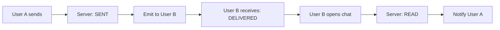

# 🎓 Теория: Advanced Messaging Backend

## 📋 Содержание
1. [Message Status System](#message-status-system)
2. [Typing Indicators](#typing-indicators)
3. [Cursor-based Pagination](#cursor-based-pagination)
4. [Full-text Search](#full-text-search)
5. [Message Actions](#message-actions)

---

## Message Status System

### 🔄 Жизненный цикл статуса сообщения

```typescript
enum MessageStatus {
  PENDING = 'pending',       // Создано локально
  SENT = 'sent',            // Отправлено на сервер
  DELIVERED = 'delivered',   // Доставлено получателю
  READ = 'read'             // Прочитано получателем
}
```

### Архитектура обновления статусов



### События WebSocket

```typescript
// Отправка сообщения
@SubscribeMessage('message:send')
async handleMessage(client: Socket, data: CreateMessageDto) {
  const message = await this.messagesService.create(data);
  message.status = MessageStatus.SENT;
  
  // Уведомляем отправителя
  client.emit('message:sent', message);
  
  // Отправляем получателям
  this.server.to(`chat-${chatId}`).emit('message:new', message);
}

// Доставка сообщения
@SubscribeMessage('message:delivered')
async handleDelivered(client: Socket, data: { messageId: string }) {
  await this.messagesService.updateStatus(
    data.messageId,
    MessageStatus.DELIVERED
  );
  
  // Уведомляем отправителя
  const message = await this.messagesService.findById(data.messageId);
  const senderId = message.sender._id;
  this.server.to(`user-${senderId}`).emit('status:updated', {
    messageId: data.messageId,
    status: MessageStatus.DELIVERED
  });
}
```

---

## Typing Indicators

### 🎯 Концепция

Typing indicators показывают, что пользователь печатает сообщение. Важные аспекты:
- **Debounce** - не спамить событиями
- **Auto-clear** - очистка через таймер
- **Memory management** - очистка при disconnect

### Архитектура Typing Manager

```typescript
@Injectable()
export class TypingManager {
  private typing = new Map<string, Set<string>>();
  private timers = new Map<string, NodeJS.Timeout>();
  
  startTyping(chatId: string, userId: string): void {
    // Добавляем в набор печатающих
    if (!this.typing.has(chatId)) {
      this.typing.set(chatId, new Set());
    }
    this.typing.get(chatId).add(userId);
    
    // Сбрасываем таймер
    this.resetTimer(chatId, userId);
  }
  
  private resetTimer(chatId: string, userId: string): void {
    const key = `${chatId}:${userId}`;
    
    // Очищаем старый таймер
    if (this.timers.has(key)) {
      clearTimeout(this.timers.get(key));
    }
    
    // Устанавливаем новый (3 секунды)
    const timer = setTimeout(() => {
      this.stopTyping(chatId, userId);
    }, 3000);
    
    this.timers.set(key, timer);
  }
  
  stopTyping(chatId: string, userId: string): void {
    const typingSet = this.typing.get(chatId);
    if (typingSet) {
      typingSet.delete(userId);
      if (typingSet.size === 0) {
        this.typing.delete(chatId);
      }
    }
    
    // Очищаем таймер
    const key = `${chatId}:${userId}`;
    if (this.timers.has(key)) {
      clearTimeout(this.timers.get(key));
      this.timers.delete(key);
    }
  }
  
  getTyping(chatId: string): string[] {
    const typingSet = this.typing.get(chatId);
    return typingSet ? Array.from(typingSet) : [];
  }
}
```

### WebSocket обработчики

```typescript
@SubscribeMessage('typing:start')
async handleTypingStart(client: Socket, data: { chatId: string }) {
  const userId = client.data.userId;
  
  this.typingManager.startTyping(data.chatId, userId);
  
  // Отправляем всем в чате кроме отправителя
  client.to(`chat-${data.chatId}`).emit('typing:update', {
    chatId: data.chatId,
    typing: this.typingManager.getTyping(data.chatId)
  });
}

@SubscribeMessage('typing:stop')
async handleTypingStop(client: Socket, data: { chatId: string }) {
  const userId = client.data.userId;
  
  this.typingManager.stopTyping(data.chatId, userId);
  
  client.to(`chat-${data.chatId}`).emit('typing:update', {
    chatId: data.chatId,
    typing: this.typingManager.getTyping(data.chatId)
  });
}
```

---

## Cursor-based Pagination

### 🔍 Почему не offset/limit?

**Проблемы offset:**
1. При добавлении новых записей offset сбивается
2. Неэффективно для больших offset (MongoDB пропускает записи)
3. Возможны дубликаты при параллельных изменениях

**Преимущества cursor:**
1. Стабильная пагинация при изменениях
2. O(1) сложность независимо от позиции
3. Нет дубликатов

### Реализация

```typescript
interface PaginationResult<T> {
  items: T[];
  hasMore: boolean;
  nextCursor?: string;
}

async getMessagesPaginated(
  chatId: string,
  cursor?: string,
  limit = 50
): Promise<PaginationResult<Message>> {
  const query: any = { chat: chatId, isDeleted: false };
  
  // Если есть курсор, используем его как точку отсчета
  if (cursor) {
    const decodedCursor = this.decodeCursor(cursor);
    query.createdAt = { $lt: new Date(decodedCursor) };
  }
  
  // Запрашиваем на 1 больше для проверки hasMore
  const messages = await this.messageModel
    .find(query)
    .sort({ createdAt: -1 })
    .limit(limit + 1)
    .populate('sender')
    .exec();
  
  // Определяем hasMore
  const hasMore = messages.length > limit;
  if (hasMore) {
    messages.pop(); // Удаляем лишний элемент
  }
  
  // Создаем курсор из последнего элемента
  const nextCursor = messages.length > 0
    ? this.encodeCursor(messages[messages.length - 1].createdAt)
    : undefined;
  
  return {
    items: messages,
    hasMore,
    nextCursor
  };
}

private encodeCursor(date: Date): string {
  return Buffer.from(date.toISOString()).toString('base64');
}

private decodeCursor(cursor: string): string {
  return Buffer.from(cursor, 'base64').toString('utf-8');
}
```

---

## Full-text Search

### 🔎 MongoDB Text Search

```typescript
// 1. Создаем текстовый индекс
@Schema()
export class Message {
  @Prop({ required: true })
  text: string;
  
  // ... другие поля
}

// В module.ts
MessageSchema.index({ text: 'text' });

// 2. Поиск с подсветкой
async searchMessages(
  chatId: string,
  query: string,
  options: SearchOptions
): Promise<SearchResult> {
  const searchQuery = {
    chat: chatId,
    $text: { $search: query },
    isDeleted: false
  };
  
  const messages = await this.messageModel
    .find(searchQuery, {
      score: { $meta: 'textScore' }
    })
    .sort({ score: { $meta: 'textScore' } })
    .limit(options.limit || 50)
    .populate('sender')
    .exec();
  
  // Подсветка результатов
  const highlighted = messages.map(msg => ({
    ...msg.toObject(),
    highlights: this.highlightMatches(msg.text, query)
  }));
  
  return {
    messages: highlighted,
    total: await this.messageModel.countDocuments(searchQuery)
  };
}

private highlightMatches(text: string, query: string): string[] {
  const words = query.split(/\s+/);
  const highlights = [];
  
  for (const word of words) {
    const regex = new RegExp(`(${this.escapeRegex(word)})`, 'gi');
    const match = text.match(regex);
    if (match) {
      highlights.push({
        word: match[0],
        position: text.indexOf(match[0])
      });
    }
  }
  
  return highlights;
}
```

---

## Message Actions

### ✏️ Редактирование сообщений

```typescript
async editMessage(
  messageId: string,
  userId: string,
  newText: string
): Promise<Message> {
  const message = await this.messageModel.findById(messageId);
  
  // Проверки безопасности
  if (!message) {
    throw new NotFoundException('Message not found');
  }
  
  if (message.sender.toString() !== userId) {
    throw new ForbiddenException('You can only edit your own messages');
  }
  
  if (message.forwarded) {
    throw new ForbiddenException('Cannot edit forwarded messages');
  }
  
  // Сохраняем историю
  if (!message.editHistory) {
    message.editHistory = [];
  }
  
  message.editHistory.push({
    text: message.text,
    editedAt: message.editedAt || message.createdAt
  });
  
  // Обновляем
  message.text = newText;
  message.editedAt = new Date();
  message.isEdited = true;
  
  await message.save();
  
  // Эмитируем событие
  this.gateway.emitMessageEdited(message);
  
  return message;
}
```

### 🗑️ Soft Delete

```typescript
async softDelete(
  messageId: string,
  userId: string
): Promise<void> {
  const message = await this.messageModel.findById(messageId);
  
  if (!message) {
    throw new NotFoundException('Message not found');
  }
  
  if (message.sender.toString() !== userId) {
    throw new ForbiddenException('You can only delete your own messages');
  }
  
  // Soft delete
  message.isDeleted = true;
  message.deletedAt = new Date();
  message.text = 'Сообщение удалено';
  
  await message.save();
  
  // Обновляем lastMessage если нужно
  const chat = await this.chatModel.findById(message.chat);
  if (chat.lastMessage?.toString() === messageId) {
    const newLastMessage = await this.messageModel
      .findOne({ chat: message.chat, isDeleted: false })
      .sort({ createdAt: -1 });
    
    chat.lastMessage = newLastMessage?._id;
    await chat.save();
  }
  
  // Эмитируем событие
  this.gateway.emitMessageDeleted(messageId, message.chat, newLastMessage);
}
```

---

## 🎯 Best Practices

### 1. Rate Limiting
```typescript
@UseGuards(ThrottlerGuard)
@Throttle(10, 60) // 10 запросов в минуту
@Post('search')
async search() { /* ... */ }
```

### 2. Валидация
```typescript
class UpdateMessageDto {
  @IsString()
  @MinLength(1)
  @MaxLength(4096)
  text: string;
}
```

### 3. Оптимизация
- Используйте индексы для часто запрашиваемых полей
- Кешируйте результаты поиска
- Batch обновления статусов
- Cleanup старых typing indicators

### 4. Безопасность
- Всегда проверяйте права доступа
- Санитизируйте входящий текст
- Логируйте важные действия
- Используйте транзакции для критических операций

---

## ✅ Проверка понимания

1. **В чем преимущество cursor-based пагинации?**
2. **Как избежать спама typing событиями?**
3. **Почему используем soft delete?**
4. **Как работает текстовый поиск MongoDB?**
5. **Зачем нужна история редактирования?**

---

## 📚 Дополнительные материалы

- [MongoDB Text Search](https://docs.mongodb.com/manual/text-search/)
- [WebSocket Rate Limiting](https://socket.io/docs/v4/server-api/#serverusefn)
- [Cursor Pagination Explained](https://slack.engineering/evolving-api-pagination-at-slack/)
- [Building Typing Indicators](https://www.pubnub.com/blog/typing-indicators-tutorial/)
