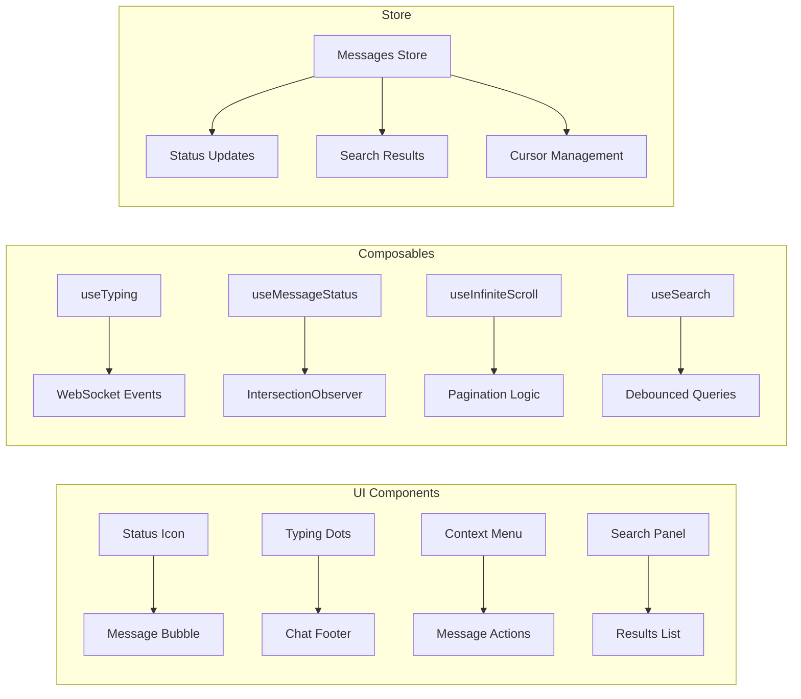

# 🎓 Day 5 Overview: Advanced Messaging & UX

## 🎯 Цель дня

Превратить базовый чат в полнофункциональный мессенджер с продвинутыми возможностями и улучшенным UX.

---

## 📊 Что будем изучать

### Backend Features
1. **Message Status System**
   - Жизненный цикл статусов (pending → sent → delivered → read)
   - Bulk updates для производительности
   - WebSocket события для real-time обновлений

2. **Typing Indicators**
   - Архитектура Typing Manager
   - Auto-cleanup через таймеры
   - Memory management при disconnect

3. **Advanced Pagination**
   - Cursor-based вместо offset
   - Эффективная загрузка истории
   - Сохранение позиции при обновлениях

4. **Full-text Search**
   - MongoDB text indexes
   - Подсветка результатов
   - Relevance scoring

5. **Message Actions**
   - Редактирование с историей
   - Soft delete с синхронизацией
   - Проверка прав доступа

### Frontend Features
1. **Status Visualization**
   - Анимированные иконки статусов
   - Real-time обновления
   - Визуальная обратная связь

2. **Typing Animation**
   - Bouncing dots анимация
   - Множественные пользователи
   - Плавные transitions

3. **Context Menu**
   - Позиционирование относительно курсора
   - Проверка границ экрана
   - Keyboard navigation

4. **Search Interface**
   - Instant search с подсветкой
   - Навигация по результатам
   - Keyboard shortcuts

5. **Infinite Scroll**
   - IntersectionObserver API
   - Virtual scrolling интеграция
   - Сохранение позиции

---

## 🏗️ Архитектура решений

### Backend Architecture

```mermaid
graph TB
    subgraph "Message Status Flow"
        A[User sends message] --> B[Status: SENT]
        B --> C[Emit to recipients]
        C --> D[Status: DELIVERED]
        D --> E[User opens chat]
        E --> F[Status: READ]
        F --> G[Notify sender]
    end
    
    subgraph "Typing System"
        H[User types] --> I[Start typing]
        I --> J[Broadcast to room]
        J --> K[3s timer]
        K --> L[Auto stop]
    end
    
    subgraph "Search System"
        M[Search query] --> N[Text index]
        N --> O[Score results]
        O --> P[Highlight matches]
        P --> Q[Return paginated]
    end
```



### Frontend Architecture



---

## 💡 Ключевые концепции

### 1. Optimistic UI Pattern

```typescript
// Сначала обновляем UI
updateUI(optimisticData)

// Затем отправляем на сервер
try {
  const serverData = await api.call()
  replaceWithServerData(serverData)
} catch (error) {
  rollback(optimisticData)
  showError(error)
}
```

**Преимущества:**
- ✅ Мгновенная обратная связь
- ✅ Лучший perceived performance
- ✅ Меньше визуальных глитчей

### 2. Cursor-based Pagination

**Offset проблемы:**
```sql
-- При добавлении новых записей offset сбивается
SELECT * FROM messages LIMIT 20 OFFSET 40
-- Если добавили 5 новых, увидим дубликаты
```

**Cursor решение:**
```typescript
// Используем timestamp как курсор
const cursor = lastMessage.createdAt
const nextPage = await Message.find({
  createdAt: { $lt: cursor }
}).limit(20)
```

### 3. Debounce vs Throttle

```typescript
// Debounce - выполнить после паузы
const search = debounce((query) => {
  api.search(query)
}, 300) // Ждем 300ms после последнего ввода

// Throttle - ограничить частоту
const handleScroll = throttle(() => {
  checkLoadMore()
}, 100) // Максимум раз в 100ms
```

### 4. IntersectionObserver для производительности

```typescript
// Вместо scroll событий
const observer = new IntersectionObserver((entries) => {
  entries.forEach(entry => {
    if (entry.isIntersecting) {
      // Элемент видим
      markAsRead(entry.target.id)
    }
  })
})

// Наблюдаем за сообщениями
messages.forEach(msg => observer.observe(msg.element))
```

---

## 📈 Метрики производительности

### Target Metrics

| Метрика | Цель | Почему важно |
|---------|------|--------------|
| Typing latency | < 50ms | Ощущение real-time |
| Status update | < 100ms | Мгновенная обратная связь |
| Search results | < 500ms | Быстрый поиск |
| Message load | < 200ms | Плавная прокрутка |
| FPS | 60 | Smooth animations |

### Оптимизации

1. **Batching Updates**
```typescript
// Вместо отдельных обновлений
messages.forEach(msg => updateStatus(msg))

// Batch обновление
bulkUpdateStatus(messages)
```

2. **Virtual Scrolling**
```typescript
// Рендерим только видимые
const visibleRange = getVisibleRange()
const renderMessages = messages.slice(
  visibleRange.start,
  visibleRange.end
)
```

3. **Memoization**
```typescript
// Кешируем вычисления
const searchResults = computed(() => {
  return memoizedSearch(query.value)
})
```

---

## 🛠️ Технологии и инструменты

### Backend Technologies
- **MongoDB Text Search** - полнотекстовый поиск
- **Bull Queue** - для фоновых задач (опционально)
- **Redis** - кеширование статусов (опционально)
- **Socket.io** - real-time события

### Frontend Technologies
- **IntersectionObserver API** - отслеживание видимости
- **Web Workers** - поиск в фоне (опционально)
- **IndexedDB** - локальный кеш (опционально)
- **CSS Animations** - GPU-ускоренные анимации

### Development Tools
- **Chrome DevTools** - профилирование
- **Lighthouse** - аудит производительности
- **WebSocket Frame Inspector** - отладка WS
- **MongoDB Compass** - анализ индексов

---

## 🎨 UI/UX Best Practices

### Visual Feedback
1. **Immediate Response**
   - Показывать pending state сразу
   - Использовать skeletons при загрузке
   - Анимировать переходы

2. **Progressive Disclosure**
   - Показывать важное сразу
   - Детали по требованию
   - Lazy load тяжелый контент

3. **Error Recovery**
   - Clear error messages
   - Retry механизмы
   - Offline support

### Accessibility
1. **Keyboard Navigation**
   - Tab order логичный
   - Shortcuts документированы
   - Focus indicators видимые

2. **Screen Readers**
   - ARIA labels присутствуют
   - Live regions для обновлений
   - Semantic HTML

3. **Performance**
   - Reduce motion опция
   - Lazy loading images
   - Code splitting

---

## 📚 Полезные паттерны

### 1. Status Management Pattern

```typescript
class StatusManager {
  private statuses = new Map<string, Status>()
  private subscribers = new Set<Subscriber>()
  
  updateStatus(messageId: string, status: Status) {
    this.statuses.set(messageId, status)
    this.notifySubscribers(messageId, status)
  }
  
  private notifySubscribers(id: string, status: Status) {
    this.subscribers.forEach(sub => sub.notify(id, status))
  }
}
```

### 2. Typing Indicator Pattern

```typescript
class TypingIndicator {
  private typing = new Map<string, Timer>()
  
  start(userId: string) {
    // Clear existing timer
    this.stop(userId)
    
    // Set new timer
    const timer = setTimeout(() => {
      this.stop(userId)
    }, 3000)
    
    this.typing.set(userId, timer)
    this.broadcast()
  }
  
  stop(userId: string) {
    const timer = this.typing.get(userId)
    if (timer) {
      clearTimeout(timer)
      this.typing.delete(userId)
      this.broadcast()
    }
  }
}
```

### 3. Infinite Scroll Pattern

```typescript
class InfiniteScroll {
  private observer: IntersectionObserver
  private loading = false
  
  constructor(private loadMore: Function) {
    this.observer = new IntersectionObserver(
      this.handleIntersection.bind(this)
    )
  }
  
  private async handleIntersection(entries: IntersectionObserverEntry[]) {
    const [entry] = entries
    if (entry.isIntersecting && !this.loading) {
      this.loading = true
      await this.loadMore()
      this.loading = false
    }
  }
  
  observe(element: Element) {
    this.observer.observe(element)
  }
}
```

---

## ✅ Чек-лист готовности

### Backend Ready
- [ ] Message schema обновлена
- [ ] DTOs созданы и валидированы
- [ ] Typing Manager реализован
- [ ] Search индексы созданы
- [ ] WebSocket события настроены
- [ ] Pagination с курсорами работает
- [ ] Soft delete реализован

### Frontend Ready
- [ ] Status компонент создан
- [ ] Typing indicator анимирован
- [ ] Context menu позиционируется
- [ ] Search panel работает
- [ ] Infinite scroll интегрирован
- [ ] Composables реализованы
- [ ] Store методы добавлены

### Integration Complete
- [ ] WebSocket события синхронизированы
- [ ] Real-time обновления работают
- [ ] Производительность оптимальна
- [ ] Ошибки обрабатываются
- [ ] UX плавный и отзывчивый

---

## 🚨 Частые ошибки

### Backend
1. **Забыть индексы**
   - Без индексов поиск будет медленным
   - Создайте составные индексы для частых запросов

2. **Memory leaks в typing**
   - Всегда очищайте таймеры
   - Удаляйте из Map при disconnect

3. **Race conditions**
   - Используйте транзакции где нужно
   - Правильный порядок операций

### Frontend
1. **Забыть cleanup**
   - Отписывайтесь от событий
   - Останавливайте observers
   - Очищайте таймеры

2. **Плохая производительность**
   - Используйте v-memo для списков
   - Debounce частые операции
   - Virtual scrolling для больших списков

3. **Accessibility**
   - Добавляйте ARIA labels
   - Поддерживайте keyboard navigation
   - Тестируйте с screen readers

---

## 🎓 Что вы изучите

После завершения Day 5 вы будете уметь:

1. **Проектировать сложные real-time системы**
   - Status tracking architecture
   - Event-driven updates
   - Optimistic UI patterns

2. **Оптимизировать производительность**
   - Efficient pagination
   - Virtual scrolling
   - Debouncing/throttling

3. **Создавать отзывчивый UX**
   - Instant feedback
   - Smooth animations
   - Error recovery

4. **Работать с современными API**
   - IntersectionObserver
   - Web Workers
   - IndexedDB

5. **Реализовывать поиск**
   - Full-text search
   - Result highlighting
   - Relevance scoring

---

## 📖 Дополнительное чтение

### Articles
- [Building WhatsApp's Status Feature](https://engineering.fb.com/2017/02/24/android/building-whatsapp-status/)
- [How Slack Handles Typing Indicators](https://slack.engineering/how-slack-handles-typing-indicators/)
- [Optimistic UI with React](https://www.apollographql.com/blog/optimistic-ui-with-apollo-client/)

### Documentation
- [MongoDB Text Search](https://docs.mongodb.com/manual/text-search/)
- [IntersectionObserver API](https://developer.mozilla.org/en-US/docs/Web/API/Intersection_Observer_API)
- [Socket.io Best Practices](https://socket.io/docs/v4/best-practices/)

### Videos
- [Optimistic UI Patterns](https://www.youtube.com/watch?v=VzRHpI_KxVE)
- [Virtual Scrolling Explained](https://www.youtube.com/watch?v=t34wPKny5CY)
- [WebSocket at Scale](https://www.youtube.com/watch?v=PjT7hTaNtqg)

---

## 🏆 Результат дня

К концу Day 5 у вас будет:

✅ **Полноценная система статусов сообщений**
- Real-time обновления
- Визуальные индикаторы
- Bulk operations

✅ **Продвинутый UX**
- Typing indicators
- Context menus
- Keyboard shortcuts

✅ **Эффективный поиск**
- Full-text search
- Highlighting
- Pagination

✅ **Оптимизированная производительность**
- Cursor pagination
- Virtual scrolling
- Debounced operations

✅ **Production-ready код**
- Error handling
- Memory management
- Accessibility

---

## 🎉 Поздравляем!

Вы освоили продвинутые техники создания современных мессенджеров! Ваше приложение теперь имеет все основные функции профессионального чата.

**Следующий шаг:** Day 6 - Media & Files
