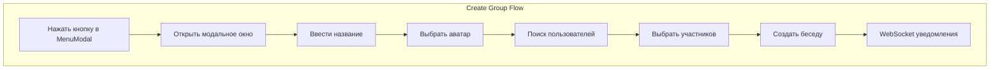
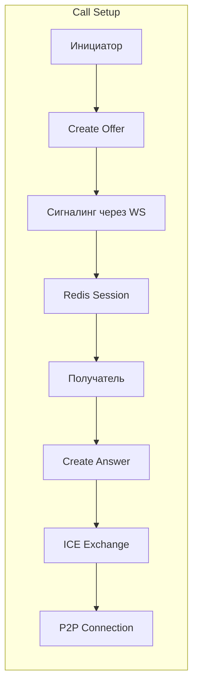

# 📚 Day 6: Group Chats & WebRTC Calls - План разработки

## 🎯 Цели дня

1. **Групповые чаты (беседы)**
   - Создание бесед с множественным выбором участников
   - Управление участниками и ролями
   - Настройки и права доступа

2. **WebRTC звонки**
   - Аудио и видео звонки 1-на-1
   - Групповые звонки в беседах
   - UI в стиле Discord
   - Шифрование и безопасность

---

## 🏗️ Архитектура

### Система групповых чатов



### WebRTC архитектура



### Redis структура для звонков

```
call:{callId}
  - chatId
  - initiatorId
  - type (audio/video)
  - status
  - participants[]
  - createdAt
  - iceServers[]

call:{callId}:sdp:{userId}
  - type (offer/answer)
  - sdp
  - timestamp

call:{callId}:ice:{userId}[]
  - candidate
  - timestamp
```

---

## 📁 Структура файлов

### Backend
```
backend/src/modules/
├── chats/
│   ├── schemas/
│   │   └── chat.schema.ts        # + поля для групп
│   ├── dto/
│   │   ├── create-group.dto.ts   # DTO создания группы
│   │   └── manage-members.dto.ts # DTO управления участниками
│   └── chats.service.ts          # + методы для групп
│
├── webrtc/
│   ├── webrtc.module.ts
│   ├── webrtc.gateway.ts         # WebSocket для звонков
│   ├── webrtc-redis.service.ts   # Redis сессии
│   └── dto/
│       └── call.dto.ts
│
└── users/
    └── users.service.ts          # + поиск пользователей
```

### Frontend
```
frontend/app/
├── components/
│   ├── chat/
│   │   ├── CreateGroupModal.vue  # Модалка создания группы
│   │   ├── MembersPanel.vue      # Панель участников
│   │   └── GroupSettings.vue     # Настройки группы
│   │
│   ├── call/
│   │   ├── CallWindow.vue        # Главное окно звонка
│   │   ├── CallControls.vue      # Контролы (mute, video, etc)
│   │   ├── ParticipantGrid.vue   # Сетка участников
│   │   ├── IncomingCall.vue      # Входящий звонок
│   │   └── CallOverlay.vue       # Оверлей во время звонка
│   │
│   └── layout/
│       └── MenuModal.vue          # + кнопка создания группы
│
├── composables/
│   ├── useWebRTC.ts              # WebRTC логика
│   ├── useCall.ts                # Управление звонками
│   └── useGroupChat.ts           # Логика групповых чатов
│
└── stores/
    ├── calls.ts                   # Store для звонков
    └── chats.ts                   # + поддержка групп
```

---

## 💻 Backend реализация

### 1. Схема групповых чатов

```typescript
// chat.schema.ts - расширение
@Schema({ timestamps: true })
export class Chat {
  @Prop({ required: true })
  name: string;

  @Prop({ 
    type: String,
    enum: ['personal', 'group', 'channel'],
    default: 'personal'
  })
  type: ChatType;

  @Prop()
  avatar?: string;

  @Prop({ maxlength: 500 })
  description?: string;

  @Prop({
    type: [{
      user: { type: Types.ObjectId, ref: 'User', required: true },
      role: { 
        type: String, 
        enum: ['owner', 'admin', 'member'],
        default: 'member'
      },
      joinedAt: { type: Date, default: Date.now },
      addedBy: { type: Types.ObjectId, ref: 'User' },
      permissions: {
        canAddMembers: { type: Boolean, default: false },
        canRemoveMembers: { type: Boolean, default: false },
        canEditInfo: { type: Boolean, default: false },
        canStartCall: { type: Boolean, default: true }
      }
    }]
  })
  participants: Participant[];

  @Prop({ type: Types.ObjectId, ref: 'User' })
  createdBy: Types.ObjectId;

  @Prop({ default: 100 })
  maxMembers: number;

  @Prop({
    type: {
      muteAll: { type: Boolean, default: false },
      onlyAdminsCanSpeak: { type: Boolean, default: false }
    }
  })
  callSettings?: CallSettings;
}
```

### 2. WebRTC Gateway основа

```typescript
// webrtc.gateway.ts
@WebSocketGateway({
  namespace: '/calls',
  cors: { origin: process.env.FRONTEND_URL, credentials: true }
})
@UseGuards(WsJwtGuard)
export class WebRTCGateway {
  constructor(
    private readonly redisService: WebRTCRedisService,
    private readonly chatsService: ChatsService
  ) {}

  @SubscribeMessage('call:initiate')
  async handleInitiate(
    @ConnectedSocket() client: Socket,
    @MessageBody() data: InitiateCallDto
  ) {
    // 1. Проверка прав
    const canCall = await this.chatsService.canStartCall(
      data.chatId, 
      client.data.userId
    );
    if (!canCall) {
      throw new WsException('No permission to start call');
    }

    // 2. Создание сессии в Redis
    const callId = await this.redisService.createCall({
      chatId: data.chatId,
      initiatorId: client.data.userId,
      type: data.type // audio | video
    });

    // 3. Уведомление участников
    await this.notifyParticipants(data.chatId, callId);

    return { callId, iceServers: this.getIceServers() };
  }
}
```

### 3. Redis Service для звонков

```typescript
// webrtc-redis.service.ts
@Injectable()
export class WebRTCRedisService {
  private readonly TTL = 12 * 60 * 60; // 12 часов

  constructor(@InjectRedis() private redis: Redis) {}

  async createCall(data: CreateCallData): Promise<string> {
    const callId = crypto.randomBytes(16).toString('hex');
    const key = `call:${callId}`;

    await this.redis.hmset(key, {
      ...data,
      status: 'initiating',
      createdAt: Date.now()
    });

    await this.redis.expire(key, this.TTL);
    return callId;
  }

  async addParticipant(callId: string, userId: string) {
    const key = `call:${callId}:participants`;
    await this.redis.sadd(key, userId);
    await this.redis.expire(key, this.TTL);
  }

  async storeSDP(callId: string, userId: string, sdp: string) {
    const key = `call:${callId}:sdp:${userId}`;
    await this.redis.set(key, sdp, 'EX', this.TTL);
  }

  async storeICE(callId: string, userId: string, candidate: any) {
    const key = `call:${callId}:ice:${userId}`;
    await this.redis.rpush(key, JSON.stringify(candidate));
    await this.redis.expire(key, this.TTL);
  }
}
```

---

## 🎨 Frontend реализация

### 1. Модальное окно создания группы

```vue
<!-- CreateGroupModal.vue -->
<template>
  <BaseModal :is-open="isOpen" @close="$emit('close')">
    <div class="create-group">
      <!-- Step 1: Информация о группе -->
      <div v-if="step === 1" class="step">
        <h2>Создание беседы</h2>
        
        <!-- Аватар -->
        <div class="avatar-upload" @click="selectAvatar">
          
          <Icon v-else name="camera" />
        </div>

        <!-- Название -->
        <BaseInput
          v-model="form.name"
          label="Название беседы"
          :max-length="100"
          required
        />

        <!-- Описание -->
        <BaseInput
          v-model="form.description"
          label="Описание"
          type="textarea"
          :max-length="500"
        />

        <button 
          class="btn btn--primary"
          :disabled="!form.name"
          @click="step = 2"
        >
          Далее
        </button>
      </div>

      <!-- Step 2: Выбор участников -->
      <div v-if="step === 2" class="step">
        <h2>Добавить участников</h2>

        <!-- Поиск -->
        <div class="search">
          <Icon name="search" />
          <input 
            v-model="searchQuery"
            placeholder="Поиск пользователей..."
            @input="searchUsers"
          >
        </div>

        <!-- Список пользователей -->
        <div class="users-list">
          <label 
            v-for="user in filteredUsers" 
            :key="user._id"
            class="user-item"
          >
            <input
              type="checkbox"
              v-model="selectedUsers"
              :value="user._id"
            >
            <Avatar :user="user" />
            <div class="user-info">
              <span>{{ user.name }}</span>
              <span class="username">@{{ user.username }}</span>
            </div>
          </label>
        </div>

        <!-- Выбранные -->
        <div v-if="selectedUsers.length" class="selected">
          Выбрано: {{ selectedUsers.length }}
        </div>

        <!-- Действия -->
        <div class="actions">
          <button @click="step = 1">Назад</button>
          <button 
            class="btn--primary"
            :disabled="!selectedUsers.length"
            @click="createGroup"
          >
            Создать
          </button>
        </div>
      </div>
    </div>
  </BaseModal>
</template>
```

### 2. WebRTC Composable

```typescript
// composables/useWebRTC.ts
export function useWebRTC() {
  const localStream = ref<MediaStream | null>(null)
  const remoteStreams = ref<Map<string, MediaStream>>(new Map())
  const peerConnections = ref<Map<string, RTCPeerConnection>>(new Map())
  
  const config = {
    iceServers: [
      { urls: 'stun:stun.l.google.com:19302' },
      { urls: 'stun:stun1.l.google.com:19302' }
    ]
  }

  async function startCall(chatId: string, type: 'audio' | 'video') {
    // 1. Получить локальный стрим
    localStream.value = await navigator.mediaDevices.getUserMedia({
      audio: true,
      video: type === 'video'
    })

    // 2. Инициировать звонок
    const { callId } = await socket.emitWithAck('call:initiate', {
      chatId,
      type
    })

    return callId
  }

  async function createPeerConnection(userId: string, isInitiator: boolean) {
    const pc = new RTCPeerConnection(config)
    
    // Добавить локальный стрим
    if (localStream.value) {
      localStream.value.getTracks().forEach(track => {
        pc.addTrack(track, localStream.value!)
      })
    }

    // Обработка ICE кандидатов
    pc.onicecandidate = (event) => {
      if (event.candidate) {
        socket.emit('call:ice-candidate', {
          targetUserId: userId,
          candidate: event.candidate
        })
      }
    }

    // Обработка удаленного стрима
    pc.ontrack = (event) => {
      remoteStreams.value.set(userId, event.streams[0])
    }

    peerConnections.value.set(userId, pc)

    // Создать offer/answer
    if (isInitiator) {
      const offer = await pc.createOffer()
      await pc.setLocalDescription(offer)
      socket.emit('call:offer', {
        targetUserId: userId,
        offer
      })
    }

    return pc
  }

  function endCall() {
    // Остановить локальный стрим
    localStream.value?.getTracks().forEach(track => track.stop())
    
    // Закрыть все соединения
    peerConnections.value.forEach(pc => pc.close())
    
    // Очистить
    localStream.value = null
    remoteStreams.value.clear()
    peerConnections.value.clear()
  }

  return {
    localStream: readonly(localStream),
    remoteStreams: readonly(remoteStreams),
    startCall,
    createPeerConnection,
    endCall
  }
}
```

### 3. Call Window (Discord Style)

```vue
<!-- CallWindow.vue -->
<template>
  <div class="call-window" :class="{ 'call-window--fullscreen': isFullscreen }">
    <!-- Header -->
    <div class="call-header">
      <div class="call-info">
        <h3>{{ chatName }}</h3>
        <span class="call-timer">{{ formattedDuration }}</span>
      </div>
      
      <div class="call-actions">
        <button @click="toggleFullscreen">
          <Icon :name="isFullscreen ? 'minimize' : 'maximize'" />
        </button>
        <button class="btn--danger" @click="endCall">
          <Icon name="x" />
        </button>
      </div>
    </div>

    <!-- Video Grid -->
    <div class="call-grid" :class="`grid--${gridLayout}`">
      <!-- Local Video -->
      <div class="participant participant--local">
        <video 
          ref="localVideo"
          autoplay
          muted
          :class="{ 'video--muted': !isVideoOn }"
        />
        <div class="participant-info">
          <span>Вы</span>
          <div class="participant-status">
            <Icon v-if="isMuted" name="mic-off" />
            <Icon v-if="!isVideoOn" name="video-off" />
          </div>
        </div>
      </div>

      <!-- Remote Participants -->
      <div 
        v-for="participant in participants"
        :key="participant.userId"
        class="participant"
        :class="{ 'participant--speaking': participant.isSpeaking }"
      >
        <video 
          :ref="el => setVideoElement(participant.userId, el)"
          autoplay
          :class="{ 'video--muted': !participant.videoOn }"
        />
        <Avatar 
          v-if="!participant.videoOn"
          :user="participant"
          size="xl"
          class="participant-avatar"
        />
        <div class="participant-info">
          <span>{{ participant.name }}</span>
          <div class="participant-status">
            <Icon v-if="participant.muted" name="mic-off" />
            <Icon v-if="!participant.videoOn" name="video-off" />
          </div>
        </div>
      </div>
    </div>

    <!-- Controls -->
    <div class="call-controls">
      <button 
        class="control-btn"
        :class="{ 'control-btn--active': !isMuted }"
        @click="toggleMute"
      >
        <Icon :name="isMuted ? 'mic-off' : 'mic'" />
      </button>

      <button 
        class="control-btn"
        :class="{ 'control-btn--active': isVideoOn }"
        @click="toggleVideo"
      >
        <Icon :name="isVideoOn ? 'video' : 'video-off'" />
      </button>

      <button 
        class="control-btn"
        :class="{ 'control-btn--active': isScreenSharing }"
        @click="toggleScreenShare"
      >
        <Icon name="monitor" />
      </button>

      <button 
        class="control-btn control-btn--danger"
        @click="endCall"
      >
        <Icon name="phone-off" />
      </button>
    </div>
  </div>
</template>

<style lang="scss" scoped>
.call-window {
  position: fixed;
  top: 50%;
  left: 50%;
  transform: translate(-50%, -50%);
  width: 90%;
  max-width: 1200px;
  height: 80vh;
  background: $bg-primary;
  border-radius: $radius-xl;
  box-shadow: $shadow-modal;
  display: flex;
  flex-direction: column;
  z-index: 1000;

  &--fullscreen {
    width: 100%;
    height: 100vh;
    max-width: 100%;
    border-radius: 0;
  }

  .call-header {
    padding: 16px 24px;
    border-bottom: 1px solid rgba($text-primary, 0.1);
    display: flex;
    justify-content: space-between;
    align-items: center;
  }

  .call-grid {
    flex: 1;
    padding: 24px;
    display: grid;
    gap: 16px;
    overflow-y: auto;

    &.grid--1 { grid-template-columns: 1fr; }
    &.grid--2 { grid-template-columns: 1fr 1fr; }
    &.grid--3,
    &.grid--4 { grid-template-columns: repeat(2, 1fr); }
    &.grid--5,
    &.grid--6 { grid-template-columns: repeat(3, 1fr); }
    &.grid--7,
    &.grid--8,
    &.grid--9 { grid-template-columns: repeat(3, 1fr); }
  }

  .participant {
    position: relative;
    background: rgba($bg-secondary, 0.5);
    border-radius: $radius;
    overflow: hidden;
    aspect-ratio: 16 / 9;

    &--speaking {
      box-shadow: 0 0 0 3px $accent-primary;
    }

    video {
      width: 100%;
      height: 100%;
      object-fit: cover;
    }

    .participant-info {
      position: absolute;
      bottom: 8px;
      left: 8px;
      padding: 4px 8px;
      background: rgba(#000, 0.7);
      border-radius: $radius-sm;
      color: white;
      font-size: 14px;
    }
  }

  .call-controls {
    padding: 16px;
    display: flex;
    justify-content: center;
    gap: 12px;
    background: rgba($bg-secondary, 0.5);

    .control-btn {
      width: 48px;
      height: 48px;
      border-radius: 50%;
      background: rgba($text-primary, 0.1);
      border: none;
      color: $text-primary;
      cursor: pointer;
      transition: all 0.2s;

      &:hover {
        background: rgba($text-primary, 0.2);
        transform: scale(1.1);
      }

      &--active {
        background: $accent-primary;
        color: white;
      }

      &--danger {
        background: #f44336;
        color: white;
      }
    }
  }
}
</style>
```

---

## 🔐 Безопасность

### WebRTC Security
1. **DTLS-SRTP** - шифрование медиа потоков
2. **TURN сервер** - для обхода NAT/Firewall
3. **Токены доступа** - проверка прав на звонок
4. **Rate limiting** - защита от спама звонков

### Конфигурация TURN
```env
TURN_SERVER_URL=turn:turn.example.com:3478
TURN_USERNAME=username
TURN_PASSWORD=securepassword
TURN_SECRET=shared_secret_for_auth
```

### Проверки безопасности
- [ ] Проверка участия в чате перед звонком
- [ ] Валидация SDP offer/answer
- [ ] Ограничение количества участников
- [ ] Автоматическое завершение после таймаута
- [ ] Логирование всех звонков

---

## 📝 Чек-лист реализации

### Backend
- [ ] Схема групповых чатов
- [ ] DTOs для создания/управления группами
- [ ] Service методы для групп
- [ ] WebRTC Gateway
- [ ] Redis Service для звонков
- [ ] Поиск пользователей API
- [ ] WebSocket события для групп
- [ ] WebSocket события для звонков

### Frontend
- [ ] CreateGroupModal компонент
- [ ] Обновление MenuModal (белые иконки + кнопка)
- [ ] CallWindow компонент
- [ ] IncomingCall компонент
- [ ] useWebRTC composable
- [ ] useCall composable
- [ ] useGroupChat composable
- [ ] Stores для звонков и групп
- [ ] Интеграция в Header.vue

### Тестирование
- [ ] Создание группы работает
- [ ] Поиск пользователей работает
- [ ] Добавление участников работает
- [ ] Звонки 1-на-1 работают
- [ ] Групповые звонки работают
- [ ] Переключение камеры/микрофона
- [ ] Демонстрация экрана
- [ ] Redis сессии сохраняются 12 часов

---

## 🎯 Результат

После выполнения Day 6:
1. ✅ Полноценные групповые чаты с управлением участниками
2. ✅ WebRTC звонки с шифрованием
3. ✅ UI в стиле Discord
4. ✅ Redis для хранения сессий звонков
5. ✅ Поиск и приглашение пользователей

---

## 📚 Материалы для изучения

- [WebRTC API](https://developer.mozilla.org/en-US/docs/Web/API/WebRTC_API)
- [Socket.io Rooms](https://socket.io/docs/v4/rooms/)
- [Redis TTL](https://redis.io/commands/expire/)
- [TURN Server Setup](https://github.com/coturn/coturn)
- [Discord UI Patterns](https://discord.com/developers/docs)
